# Single-Cell RNA-seq Analysis

> **Course:** Special Topics in Bioinformatics
> **Student:** Nawal Babar
> **Due Date:** 19th April 2026
> **Platform:** Galaxy (usegalaxy.org) + Python (Google Colab)

[](https://usegalaxy.org)
[](https://python.org)
[](https://scanpy.readthedocs.io/)

---

## Overview

This repository contains the complete workflow for single-cell RNA sequencing (scRNA-seq) data analysis. The pipeline is divided into three sections, each covering a key stage — from raw data preprocessing all the way to downstream analysis and understanding the data format used throughout.

The three sections follow a logical pipeline:

> **Raw 10X Data → Preprocessing → Analysis → Data Structure (AnnData)**

Each section has its own sub-folder containing the relevant notebooks, outputs, and a detailed README.

---

## What Is Single-Cell RNA-seq?

In bulk RNA-seq, you measure the **average** gene expression across thousands of cells — masking the diversity within a tissue. **Single-cell RNA-seq (scRNA-seq)** sequences each cell individually, revealing:

- Distinct **cell types** within a mixed tissue
- **Rare cell populations** hidden in bulk averages
- **Cell-state transitions** and developmental trajectories
- **Gene expression heterogeneity** between cells of the same type

---

## Full Pipeline Overview

```
Raw 10X FASTQ reads
        │
        ▼
    DropletUtils (Galaxy)  ─────────────► Cell × Gene count matrix
        │                                 (barcodes.tsv, genes.tsv, matrix.mtx)
        ▼
    Read into AnnData object (Scanpy)
        │
        ▼
    Step 1 — Quality Control
    ├── Violin plots: n_genes, total_counts, pct_counts_mt
    └── Scatter plot: genes vs counts coloured by MT%
        │
        ▼
    Step 2 — Filter low-quality cells & lowly expressed genes
        │
        ▼
    Step 3 — Normalization + Log1p transformation
        │
        ▼
    Step 4 — Highly Variable Gene selection (dispersion plot)
        │
        ▼
    Step 5 — PCA → variance ratio plot
        │
        ▼
    Step 6 — PCA scatter (sample + MT% coloured)
        │
        ▼
    Step 7 — Neighbourhood graph → UMAP
        │
        ▼
    Step 8 — Leiden clustering (resolution sweep: 0.02, 0.50, 2.00)
        │
        ▼
    Step 9 — Doublet detection (Scrublet)
        │
        ▼
    Step 10 — UMAP QC overlay (counts, MT%, n_genes)
        │
        ▼
    Step 11 — Marker gene dot plots → Cell type annotation
        │
        ▼
    Step 12 — NK cell marker gene UMAPs
```

---

## Section 1 — Pre-processing of 10X Single-Cell RNA Datasets

Raw single-cell RNA sequencing data from 10X Genomics cannot be analyzed directly — it first needs to be preprocessed to produce a clean gene expression count matrix. This section follows the Galaxy Training Network tutorial to perform quality control, filtering, and alignment of raw reads.

### Key steps covered
- Loading raw 10X FASTQ data on Galaxy
- Running DropletUtils to call real cells vs empty droplets
- Generating a count matrix (barcodes, genes, matrix) for downstream analysis
- MultiQC quality report of raw reads

### Output Files

| File | Contents |
|------|----------|
| `Galaxy42-[...Barcodes...].tsv` | One cell barcode per line — identifies each cell |
| `Galaxy43-[...Genes...].tsv` | One gene ID + name per line |
| `Galaxy44-[...Matrices...].mtx` | Sparse UMI count matrix (cell × gene) |
| `MultiQC_on_dataset_34__Webpage_html.html` | Full QC report — open in browser |

> **Why sparse format?** A typical experiment has 10,000 cells × 30,000 genes = 300 million values. Since ~90% are zero (most genes not expressed per cell), only non-zero values are stored — saving enormous memory.

📁 [Go to Section 1 →](01_preprocessing/)

---

## Section 2 — Basic scRNA-seq Analysis with Scanpy

Once we have a clean count matrix from preprocessing, the core analysis is performed in Python using **Scanpy**. The full pipeline is in `02_scrna_analysis/basic_scrna.ipynb`.

---

### Step 1 — Quality Control

Three QC metrics are computed per cell and visualised as violin plots:

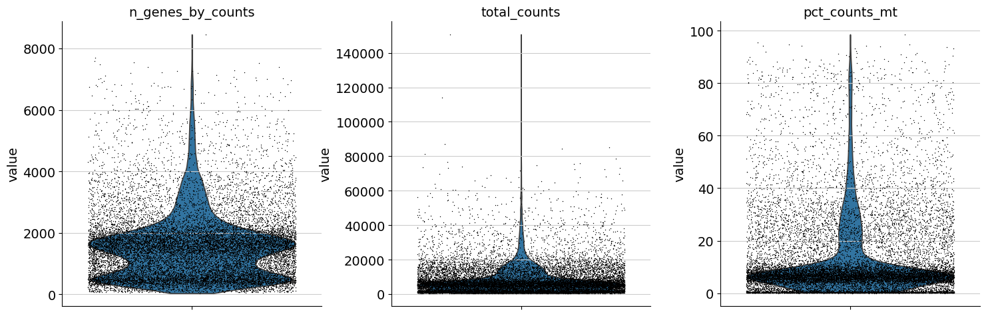

> **Left:** `n_genes_by_counts` — number of unique genes detected per cell. Very low = empty droplet or dead cell. Very high = possible doublet (two cells captured together).
> **Middle:** `total_counts` — total UMI counts per cell. Reflects sequencing depth.
> **Right:** `pct_counts_mt` — percentage of counts from mitochondrial genes. High MT% (>20%) indicates a damaged/dying cell whose cytoplasmic RNA has leaked out, leaving mostly MT transcripts.

---

### Step 2 — Scatter Plot: Genes vs Counts coloured by MT%

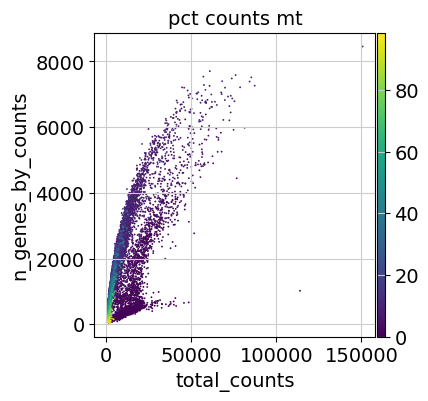

> Each dot is a cell. X-axis = total UMI counts, Y-axis = number of genes detected, colour = MT%. The expected pattern is a positive correlation between counts and genes — outliers (high counts but few genes, or high MT%) are low-quality cells to be filtered out.

---

### Step 3 — Highly Variable Gene Selection

After normalization, genes are ranked by their variability across cells. Only the most variable genes carry meaningful biological signal — housekeeping genes expressed uniformly contribute noise.

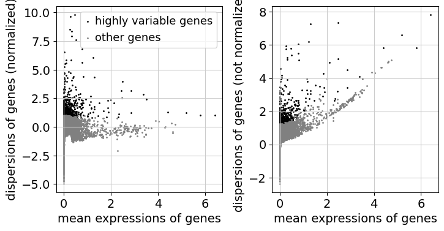

> **Left:** Normalized dispersion vs mean expression. Black dots = selected highly variable genes. Grey = other genes. Genes are selected from the high-dispersion region after normalizing for the mean-variance relationship.
> **Right:** Raw (non-normalized) dispersion, showing the mean-variance trend before normalization.

---

### Step 4 — PCA Variance Ratio (Elbow Plot)

Principal Component Analysis reduces thousands of gene dimensions to a manageable number of components. The elbow plot shows how much variance each PC explains.

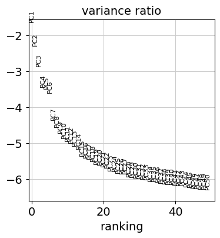

> The steep drop after ~PC7 indicates diminishing returns — the first 7–10 PCs capture most of the biological variance. Components beyond ~PC20 capture mostly noise. This informs how many PCs to use for the neighbourhood graph (here: 40 PCs used).

---

### Step 5 — PCA Scatter (Sample + MT%)

PCA embedding coloured by sample identity and mitochondrial content.

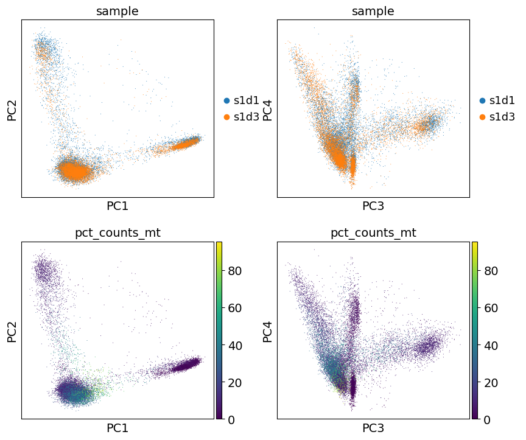

> **Top row:** Cells coloured by sample (s1d1 = blue, s1d3 = orange). The two samples mix well in PCA space — no strong batch effect separating them.
> **Bottom row:** Same PCA coloured by MT%. High-MT cells (yellow) concentrate in specific regions, confirming they form distinct low-quality clusters that will be filtered.

---

### Step 6 — UMAP coloured by Sample

After computing the neighbourhood graph from PCA coordinates, UMAP projects all cells into 2D.

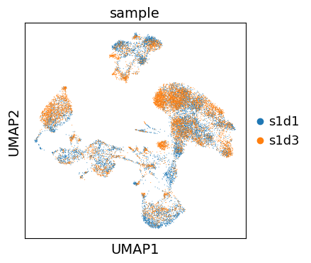

> The two samples (s1d1 and s1d3) are well-mixed across all UMAP clusters — there is no strong batch separation. This means the biological variation dominates over technical variation between samples.

---

### Step 7 — Leiden Clustering (Initial)

Leiden community detection applied to the neighbourhood graph identifies distinct cell populations.

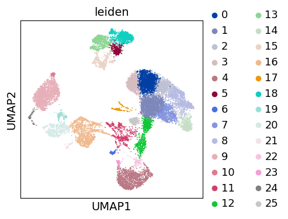

> 26 clusters (0–25) are identified at the default resolution. Each cluster represents a transcriptionally distinct cell population. The spatial organisation in UMAP reflects transcriptional similarity — nearby clusters are more similar.

---

### Step 8 — Doublet Detection (Scrublet)

Doublets are droplets containing two cells instead of one. They appear as artificial intermediate cell states between real populations and must be identified and removed.

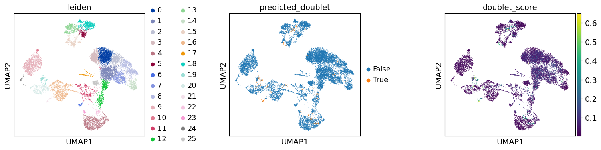

> **Left:** Leiden clusters with doublets overlaid. **Middle:** Predicted doublets (orange = doublet, blue = singlet). Doublets concentrate at the interfaces between clusters — exactly where artificial intermediate states would appear. **Right:** Doublet score continuous values — higher score = more likely doublet.

---

### Step 9 — UMAP QC Overlay

Key QC metrics overlaid onto the final UMAP to confirm filtering worked correctly.

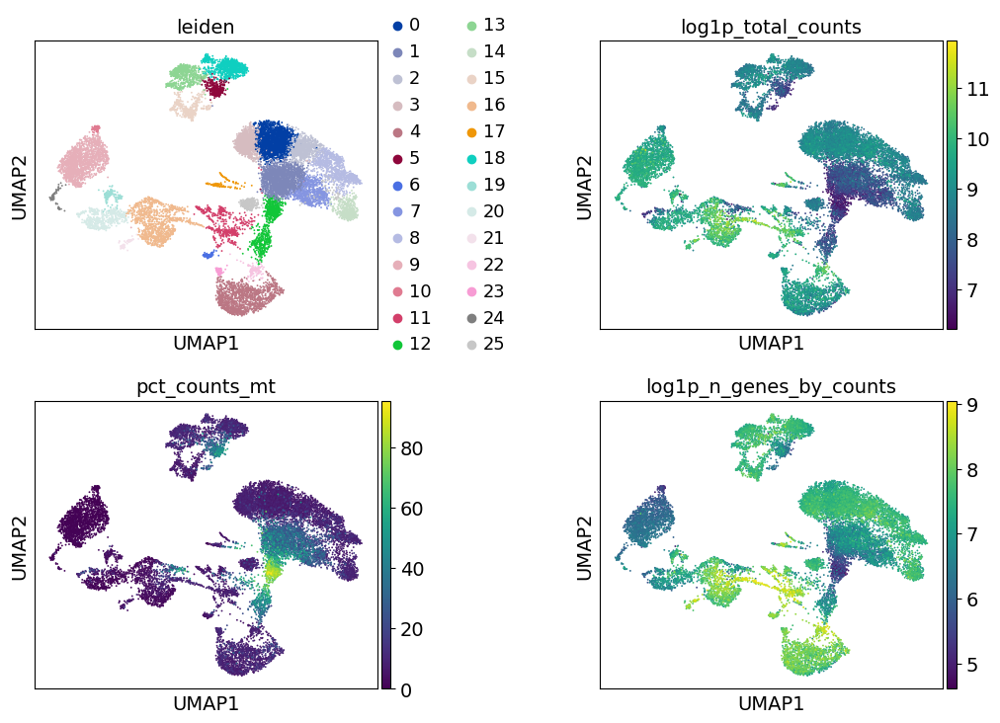

> **Top left:** Leiden clusters (final after doublet removal). **Top right:** log1p total counts — all clusters show similar sequencing depth, confirming no depth-driven artefacts. **Bottom left:** MT% — the high-MT cluster has been removed. **Bottom right:** log1p n_genes — gene detection is consistent across clusters.

---

### Step 10 — Leiden Resolution Comparison

The Leiden resolution parameter controls cluster granularity. Three resolutions are compared:

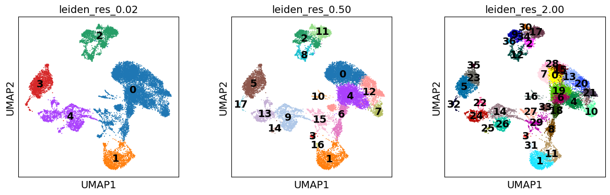

> **Left (res=0.02):** 5 very broad clusters — too coarse, merges distinct cell types. **Middle (res=0.50):** 18 clusters — good balance between resolution and interpretability. **Right (res=2.00):** 37 clusters — over-clustered, splitting single cell types into sub-states. **Resolution 0.50 was selected** for downstream analysis.

---

### Step 11 — Marker Gene Dot Plot (Before Annotation)

For each Leiden cluster, the top marker genes are identified by ranking genes differentially expressed in that cluster vs all others.

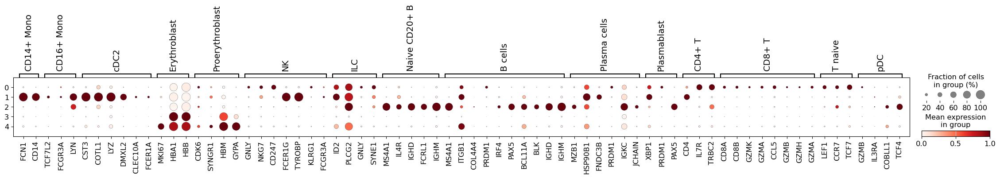

> Rows = Leiden clusters (0–4). Columns = known cell type marker genes grouped by cell type. **Dot size** = fraction of cells in that cluster expressing the gene. **Dot colour** = mean expression level. This allows each cluster to be matched to a known cell type.

---

### Step 12 — Marker Gene Dot Plot (All Clusters, res=0.50)

Full dot plot after running marker gene analysis at resolution 0.50 (18 clusters):

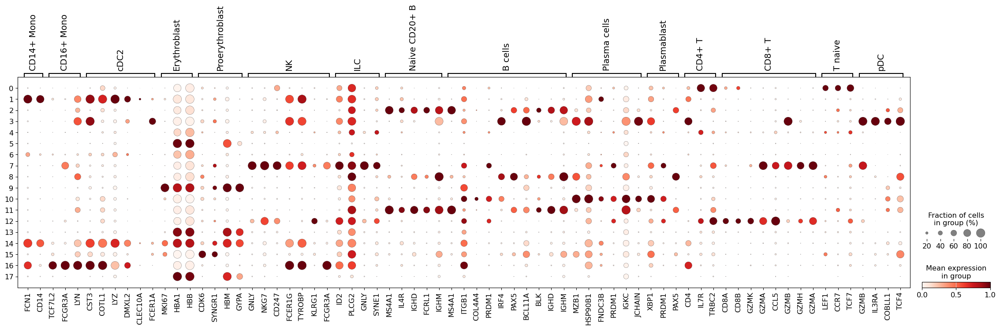

> Each row is a cluster (0–17). Known marker genes for each cell type are shown on the x-axis, grouped by cell type label. Strong diagonal patterns (large, dark dots in specific cluster-gene combinations) confirm clean cluster separation and successful cell type identification. Key identifiable populations include: **CD14+ Monocytes** (FCN1, CD14), **Erythroblasts** (HBA1, HBB), **NK cells** (NKG7, GNLY), **B cells** (IGHM, IGHD), **T cells** (CD4, CD8B).

---

### Step 13 — Clustered Dot Plot with Dendrogram

Hierarchically clustered dot plot showing relationships between clusters based on their marker gene profiles:

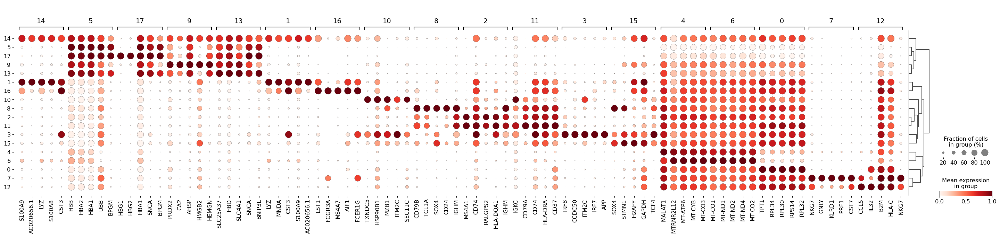

> The dendrogram on the right clusters similar cell types together — T cell subtypes cluster near each other, as do B cell subtypes. This confirms the biological coherence of the clustering and helps identify which clusters represent the same broad lineage.

---

### Step 14 — NK Cell Marker Gene UMAPs

Spatial expression of NK cell-specific marker genes across the UMAP:

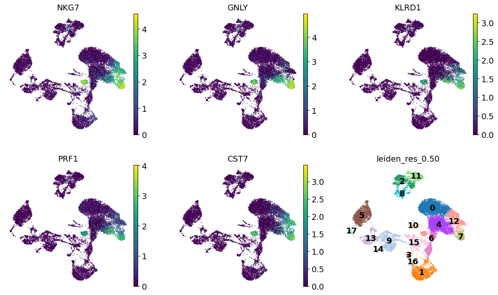

> **NKG7, GNLY, KLRD1, PRF1, CST7** — all NK cell cytotoxic markers — are highly expressed in the same specific UMAP region (top-right cluster), confirming that cluster is NK cells. This is the final step of manual cell type annotation: matching marker gene spatial patterns to cluster positions. The bottom-right panel shows the final leiden_res_0.50 cluster map for reference.

---

### Cell Types Identified

| Cluster(s) | Cell Type | Key Markers |
|------------|-----------|-------------|
| 0, 1 | CD14+ Monocytes | FCN1, CD14, LYZ |
| 2 | CD16+ Monocytes | FCGR3A, MS4A7 |
| 3 | cDC2 | CD1C, FCER1A |
| 4, 5 | Erythroblasts | HBA1, HBB, MKI67 |
| 6 | Proerythroblasts | CDK6, SYNGR1 |
| 7 | NK cells | NKG7, GNLY, KLRD1, PRF1 |
| 8 | ILC | FCER1G, KLRG1 |
| 9, 10 | Naive CD20+ B cells | MS4A1, CD79A |
| 11 | B cells | IGHM, IGHD, BCL11A |
| 12, 13 | Plasma cells / Plasmablasts | MZB1, XBP1, JCHAIN |
| 14, 15 | CD4+ T cells | CD4, IL7R |
| 16 | CD8+ T cells | CD8A, CD8B |
| 17 | T naive | LEF1, TCF7 |

📁 [Go to Section 2 →](02_scrna_analysis/)

---

## Section 3 — AnnData Data Structure

Throughout this pipeline, data is stored in the **AnnData** (Annotated Data) format — the standard for single-cell analysis in Python.

### AnnData Structure

```
AnnData object
│
├── .X          ──► Count matrix (cells × genes) — the core data
├── .obs         ──► Cell metadata (barcodes, cluster IDs, QC metrics)
├── .var         ──► Gene metadata (gene names, highly variable flag)
├── .obsm        ──► Embeddings (PCA, UMAP coordinates)
├── .obsp        ──► Pairwise distances (neighbourhood graph)
└── .uns         ──► Unstructured data (colour palettes, DE results)
```

### Key Operations

```python
import anndata as ad
import scanpy as sc

# Read/write
adata = sc.read_10x_mtx('path/to/data/')
adata.write('output.h5ad')
adata = ad.read_h5ad('output.h5ad')

# Subsetting
adata_subset = adata[adata.obs['leiden'] == '0']   # Select cluster 0
adata_genes   = adata[:, ['NKG7', 'CD14']]          # Select specific genes

# Inspect
print(adata)          # Summary of dimensions
adata.obs.head()      # Cell metadata table
adata.var.head()      # Gene metadata table
```

> **Open `getting_started.ipynb`** to work through AnnData creation, slicing, and manipulation hands-on.

📁 [Go to Section 3 →](03_anndata/)

---

## Repository Structure

```
single-cell-rna-seq-assignment/
├── README.md
├── images/
│   └── scrna/
│       ├── plot_01.png   ← QC violin plots
│       ├── plot_02.png   ← Scatter: genes vs counts coloured by MT%
│       ├── plot_03.png   ← Highly variable genes dispersion
│       ├── plot_04.png   ← PCA elbow (variance ratio)
│       ├── plot_05.png   ← PCA scatter by sample + MT%
│       ├── plot_06.png   ← UMAP by sample
│       ├── plot_07.png   ← UMAP Leiden clusters (initial)
│       ├── plot_08.png   ← Doublet detection (Scrublet)
│       ├── plot_09.png   ← UMAP QC overlay (counts, MT%, genes)
│       ├── plot_10.png   ← Leiden resolution comparison (0.02/0.50/2.00)
│       ├── plot_11.png   ← Leiden resolution comparison (duplicate view)
│       ├── plot_12.png   ← Marker dot plot (early clusters 0–4)
│       ├── plot_13.png   ← Marker dot plot (all 18 clusters, res=0.50)
│       ├── plot_14.png   ← Clustered dot plot with dendrogram
│       └── plot_15.png   ← NK cell marker gene UMAPs
├── 01_preprocessing/
│   ├── README.md
│   ├── Galaxy42-[DropletUtils 10X Barcodes...].tsv
│   ├── Galaxy43-[DropletUtils 10X Genes...].tsv
│   ├── Galaxy44-[DropletUtils 10X Matrices...].mtx
│   └── MultiQC_on_dataset_34__Webpage_html.html
├── 02_scrna_analysis/
│   ├── README.md
│   └── basic_scrna.ipynb
└── 03_anndata/
    ├── README.md
    └── getting_started.ipynb
```

---

## Key Concepts Summary

| Concept | Explanation |
|---------|-------------|
| Cell barcode | Unique DNA sequence identifying which cell a read came from |
| UMI | Unique Molecular Identifier — counts original mRNA molecules, not PCR copies |
| Sparse matrix | Stores only non-zero values — essential for large cell × gene matrices |
| Library-size normalisation | Corrects for different sequencing depths across cells |
| Highly variable genes | Genes with most cell-to-cell variation — most informative for clustering |
| PCA | Reduces thousands of gene dimensions to ~50 principal components |
| UMAP | 2D visualisation preserving local and global structure |
| Leiden clustering | Graph-based community detection — identifies cell type groups |
| Doublets | Two cells in one droplet — appear as artificial intermediate states |
| Marker genes | Genes specifically expressed in one cluster — used for cell type annotation |
| AnnData | Python data structure holding all scRNA-seq data and analysis results |

---

## Tools & Libraries

| Tool | Purpose |
|------|---------|
| [Galaxy Project](https://usegalaxy.org/) | Cloud-based preprocessing pipeline |
| [Scanpy](https://scanpy.readthedocs.io/) | Single-cell analysis in Python |
| [AnnData](https://anndata.readthedocs.io/) | Annotated data format for scRNA-seq |
| [Scrublet](https://github.com/swolock/scrublet) | Doublet detection |
| [DropletUtils](https://bioconductor.org/packages/DropletUtils/) | 10X data import and cell calling |

---

*Submitted as part of BI-436 Special Topics in Bioinformatics coursework — Nawal Babar, 2026*
